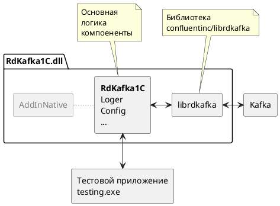

# Сборка внешней комопненты RdKafka1C

## Требуемое программное обеспечение

- [Платформа 1С Предприятие](https://1c.ru)
- [MS Visual Studio C++](https://visualstudio.microsoft.com/) - для Windows
- Компилятор g++ - для Linux
- [MS VSCode](https://code.visualstudio.com/)
- [CMake](https://github.com/Kitware/CMake/releases)
- [vcpkg](https://github.com/microsoft/vcpkg)
- [Docker](https://www.docker.com)

## Сборка

Чтобы собрать проект необходимо:

1. Установить требуемое программное обеспечение
2. Выполнить первоначальную [настройку cmake](./doc/cmake.md)
3. Выполнить первоначальную [настройку vcpkg](./doc/vcpkg.md)
4. Запустить скрипт сборки `/build.bat` или `/build.sh` для Linux
5. Собрать [тестовый инстанс Apache Kafka](./doc/kafka.md)

[*] Компилятор g++ в Linux можно установить командой:
```sh
sudo apt install g++
```

Результатом сборки будет динамическая библиотека для Windows `/build/Release/RdKafka1C.dll` или для Linux `/build/Release/libRdKafka1C.so` скомпилированная в режиме Relese, которую можно подключить к 1С, но нельзя отлаживать. Для отладки тредуется собрать библиотеку с параметром `--config "Release"` через IDE или скрипт cmake.

## Сборка на Oracle Linux 9 / RHEL 9

Проверено на Oracle Linux 9.8 x86_64 (GCC 11.5, CMake 3.31).

```sh
sudo dnf install -y gcc gcc-c++ make cmake git curl zip unzip tar perl perl-IPC-Cmd pkgconf-pkg-config \
    kernel-headers libuuid-devel cyrus-sasl-devel glibc-langpack-ru
export VCPKG_ROOT=~/vcpkg
./build.sh          # библиотека
./build-tests.sh    # модульные тесты: ./build/ModuleTests
```

- `cyrus-sasl-devel` нужен для механизма SASL GSSAPI (Kerberos): librdkafka линкуется с системной `libsasl2.so.3`,
  остальные зависимости (OpenSSL, librdkafka, Boost, lz4, zstd, zlib) вшиваются статически. Подробнее — `ports-overlay/README.md`.
- `glibc-langpack-ru` нужен модульным тестам (локаль `ru_RU`).
- Скрипты собирают в режиме Release (`-DCMAKE_BUILD_TYPE=Release`): без этого генератор Makefiles соберёт отладочную
  библиотеку с отладочными вариантами зависимостей.

Библиотека, собранная на OL9, требует glibc 2.34 и новее и системную `libsasl2.so.3`, поэтому загружается только
на RHEL-подобных системах 9 и новее (RHEL, Oracle Linux, Rocky, Alma). Для Debian/Ubuntu/Astra библиотеку нужно
собирать на целевом дистрибутиве: там вместо `cyrus-sasl-devel` ставится `libsasl2-dev`
(`sudo apt install libsasl2-dev pkg-config`), и библиотека будет зависеть от `libsasl2.so.2`.

### RPM-пакеты (RHEL/OL 9)

Готовые пакеты лежат в `package/rpm/`:

| Пакет | Что ставит | Зависимости |
|---|---|---|
| `rdkafka-1c-<версия>.el9.x86_64.rpm` | `/opt/rdkafka-1c/libRdKafka1C.so`, `/opt/rdkafka-1c/RdKafka1C.zip` | `cyrus-sasl-lib`, `glibc-langpack-ru` и `glibc-gconv-extra` (локаль ru_RU, ISO-8859-5), glibc ≥ 2.34, libstdc++ (GLIBCXX_3.4.29) |
| `rdkafka-1c-kerberos-<версия>.el9.noarch.rpm` | только README (метапакет) | `rdkafka-1c` той же версии, `cyrus-sasl-gssapi`, `krb5-workstation` |

Установка: `sudo dnf install ./rdkafka-1c-*.x86_64.rpm` (и `./rdkafka-1c-kerberos-*.noarch.rpm`, если нужен Kerberos) —
dnf сам поставит зависимости.

Сборка пакетов после `./build.sh` и обновления `package/RdKafka1C.zip` (нужен `rpm-build`):

```sh
sudo dnf install -y rpm-build
packaging/rpm/build-rpm.sh              # версия берётся из src/AddInNative.h и сверяется с INFO.XML в zip
RELEASE=2 packaging/rpm/build-rpm.sh    # пересборка той же версии: выпуск нужно повысить
```

Скрипт проверяет, что `build/libRdKafka1C.so` совпадает с библиотекой внутри `package/RdKafka1C.zip`,
добавляет лицензии вшитых библиотек из `build/vcpkg_installed` и кладёт `*.x86_64.rpm` и `*.noarch.rpm`
в `package/rpm/`. Spec — `packaging/rpm/rdkafka-1c.spec`; пакет — перепаковка готовой библиотеки,
поэтому src.rpm не собирается.

### Требования к серверу 1С (Linux)

- пакет `cyrus-sasl-lib` — обязателен (без него компонента не загрузится);
- локаль `ru_RU` (`glibc-langpack-ru`) и её конвертер ISO-8859-5 (`glibc-gconv-extra`) — обязательны: без них
  кириллические строки из 1С (id сообщений, топики) становятся пустыми;
- для аутентификации Kerberos (`sasl.mechanisms=GSSAPI`): `cyrus-sasl-gssapi`, `krb5-workstation` (команда `kinit`),
  настроенный `/etc/krb5.conf` и keytab, доступный пользователю, от имени которого работает сервер 1С.
- в `sasl.kerberos.kinit.cmd` нельзя вписывать пароли и другие секреты (в том числе подстановкой `%{sasl.password}`):
  при уровне логирования `debug` librdkafka пишет в лог компоненты готовую команду kinit и всю изменённую конфигурацию
  без маскирования этой настройки. Используйте keytab (`sasl.kerberos.keytab`).

## Сборка под Windows

Проверено на Windows 11 24H2 x64 (Visual Studio 2022 Build Tools, MSVC 14.44, CMake 3.31 из состава VS).

Нужны Visual Studio 2022 или Build Tools с рабочей нагрузкой «Разработка классических приложений на C++»
(MSVC x64, Windows SDK, CMake), Git и vcpkg на baseline из `vcpkg-configuration.json`. Perl, NASM и другие
инструменты для сборки OpenSSL vcpkg скачивает сам. Команды выполняются в «x64 Native Tools Command Prompt
for VS 2022» (там в PATH есть CMake из состава VS):

```bat
git clone https://github.com/microsoft/vcpkg C:\vcpkg
git -C C:\vcpkg checkout 66c2e79629f49083131c93c9358a7bd1a4d7ffa6
C:\vcpkg\bootstrap-vcpkg.bat -disableMetrics
set VCPKG_ROOT=C:\vcpkg
```

Затем по одному (оба скрипта в конце ждут нажатия клавиши):

- `build.bat` — библиотека `build\Release\RdKafka1C.dll`;
- `build-tests.bat` — модульные тесты `build\Release\ModuleTests.exe`.

Особенности:

- Триплет `x64-windows-static-md` задан в `CMakeLists.txt`, передавать его не нужно. OpenSSL, librdkafka и
  остальные зависимости вшиваются в DLL. От системы нужны только библиотеки Windows и среда выполнения
  VC++ 2015–2022 версии не ниже 14.44 (`MSVCP140.dll`, `VCRUNTIME140.dll`, `VCRUNTIME140_1.dll`).
- Kerberos (GSSAPI) на Windows librdkafka реализует через встроенный SSPI с учётными данными пользователя,
  под которым работает процесс: `sasl.kerberos.keytab` и `sasl.kerberos.kinit.cmd` там не используются.
- Первая сборка с пустым кэшем vcpkg занимает около 40 минут, повторные — несколько минут
  (двоичный кэш `%LOCALAPPDATA%\vcpkg\archives`).

## Разработка

Для разработки на Windows и Linux использовался [MS VSCode](https://code.visualstudio.com/) для отладки на Windows из 1С [MS Visual Studio C++](https://visualstudio.microsoft.com/).

## Тесты

Компонента покрыта интеграционными тестами на основе библиотеки [GTest](https://github.com/google/googletest). Тесты проверяют корректность выполнения обмена и обработку ошибкок с тестовым инстансом Kafka.



## Известные проблемы

### Ошибка "No such file or directory"

При сборке на Ubuntu Server может появиться ошибка `uuid/uuid.h: No such file or directory`. Необходимо установить пакет uuid.

```sh
sudo apt install uuid-dev
```

### Ошибка "CMake was unable to find a build program corresponding to "Unix Makefiles"

При сборке на Ubuntu Server может появиться ошибка:

CMake Error: CMake was unable to find a build program corresponding to "Unix Makefiles".  CMAKE_MAKE_PROGRAM is not set.  You probably need to select a different build tool.
-- Configuring incomplete, errors occurred!

Необходимо установить утилиту make:

```sh
sudo apt install make
```

### Ошибка "No targets specified and no makefile found"

При сборке на Ubuntu Server может появиться данная ошибка. Необходимо установить генератор makefiles для UNIX.

```sh
sudo apt install make
```
