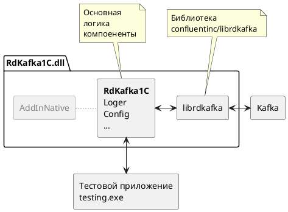

# Сборка внешней комопненты RdKafka1C

## Требуемое программное обеспечение

- [Платформа 1С Предприятие](https://1c.ru)
- [MS Visual Studio C++](https://visualstudio.microsoft.com/) - для Windows
- Компилятор g++ - для Linux
- [MS VSCode](https://code.visualstudio.com/)
- [CMake](https://github.com/Kitware/CMake/releases)
- [vcpkg](https://github.com/microsoft/vcpkg)
- [Docker](https://www.docker.com)

## Сборка

Чтобы собрать проект необходимо:

1. Установить требуемое программное обеспечение
2. Выполнить первоначальную [настройку cmake](./doc/cmake.md)
3. Выполнить первоначальную [настройку vcpkg](./doc/vcpkg.md)
4. Запустить скрипт сборки `/build.bat` или `/build.sh` для Linux
5. Собрать [тестовый инстанс Apache Kafka](./doc/kafka.md)

[*] Компилятор g++ в Linux можно установить командой:
```sh
sudo apt install g++
```

Результатом сборки будет динамическая библиотека для Windows `/build/Release/RdKafka1C.dll` или для Linux `/build/Release/libRdKafka1C.so` скомпилированная в режиме Relese, которую можно подключить к 1С, но нельзя отлаживать. Для отладки тредуется собрать библиотеку с параметром `--config "Release"` через IDE или скрипт cmake.

## Сборка на Oracle Linux 9 / RHEL 9

Проверено на Oracle Linux 9.8 x86_64 (GCC 11.5, CMake 3.31).

```sh
sudo dnf install -y gcc gcc-c++ make cmake git curl zip unzip tar perl perl-IPC-Cmd pkgconf-pkg-config \
    kernel-headers libuuid-devel cyrus-sasl-devel glibc-langpack-ru
export VCPKG_ROOT=~/vcpkg
./build.sh          # библиотека
./build-tests.sh    # модульные тесты: ./build/ModuleTests
```

- `cyrus-sasl-devel` нужен для механизма SASL GSSAPI (Kerberos): librdkafka линкуется с системной `libsasl2.so.3`,
  остальные зависимости (OpenSSL, librdkafka, Boost, lz4, zstd, zlib) вшиваются статически. Подробнее — `ports-overlay/README.md`.
- `glibc-langpack-ru` нужен модульным тестам (локаль `ru_RU`).
- Скрипты собирают в режиме Release (`-DCMAKE_BUILD_TYPE=Release`): без этого генератор Makefiles соберёт отладочную
  библиотеку с отладочными вариантами зависимостей.

Библиотека, собранная на OL9, требует glibc 2.34 и новее и системную `libsasl2.so.3`, поэтому загружается только
на RHEL-подобных системах 9 и новее (RHEL, Oracle Linux, Rocky, Alma). Для Debian/Ubuntu/Astra библиотеку нужно
собирать на целевом дистрибутиве: там вместо `cyrus-sasl-devel` ставится `libsasl2-dev`
(`sudo apt install libsasl2-dev pkg-config`), и библиотека будет зависеть от `libsasl2.so.2`.

### Требования к серверу 1С (Linux)

- пакет `cyrus-sasl-lib` — обязателен (без него компонента не загрузится);
- для аутентификации Kerberos (`sasl.mechanisms=GSSAPI`): `cyrus-sasl-gssapi`, `krb5-workstation` (команда `kinit`),
  настроенный `/etc/krb5.conf` и keytab, доступный пользователю, от имени которого работает сервер 1С.
- в `sasl.kerberos.kinit.cmd` нельзя вписывать пароли и другие секреты (в том числе подстановкой `%{sasl.password}`):
  при уровне логирования `debug` librdkafka пишет в лог компоненты готовую команду kinit и всю изменённую конфигурацию
  без маскирования этой настройки. Используйте keytab (`sasl.kerberos.keytab`).

## Разработка

Для разработки на Windows и Linux использовался [MS VSCode](https://code.visualstudio.com/) для отладки на Windows из 1С [MS Visual Studio C++](https://visualstudio.microsoft.com/).

## Тесты

Компонента покрыта интеграционными тестами на основе библиотеки [GTest](https://github.com/google/googletest). Тесты проверяют корректность выполнения обмена и обработку ошибкок с тестовым инстансом Kafka.



## Известные проблемы

### Ошибка "No such file or directory"

При сборке на Ubuntu Server может появиться ошибка `uuid/uuid.h: No such file or directory`. Необходимо установить пакет uuid.

```sh
sudo apt install uuid-dev
```

### Ошибка "CMake was unable to find a build program corresponding to "Unix Makefiles"

При сборке на Ubuntu Server может появиться ошибка:

CMake Error: CMake was unable to find a build program corresponding to "Unix Makefiles".  CMAKE_MAKE_PROGRAM is not set.  You probably need to select a different build tool.
-- Configuring incomplete, errors occurred!

Необходимо установить утилиту make:

```sh
sudo apt install make
```

### Ошибка "No targets specified and no makefile found"

При сборке на Ubuntu Server может появиться данная ошибка. Необходимо установить генератор makefiles для UNIX.

```sh
sudo apt install make
```
